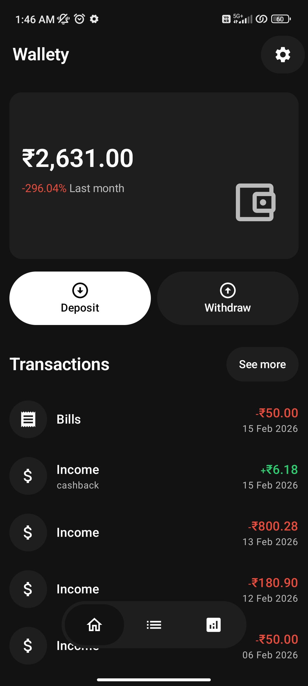

# Wallety

**Take Control of Your Finances with Wallety**

Wallety is a minimal, privacy-first expense tracker that helps you manage your money with ease. Record deposits and withdrawals, organize transactions into categories, visualize your spending, and securely back up your data to Google Drive.

## Features

* 💰 Track deposits and withdrawals
* 🏷️ Organize transactions with categories
* 📊 Interactive charts and spending insights
* 🔍 Search and filter transactions
* ☁️ Google Drive backup and restore
* 🔒 Privacy-first — your data stays on your device unless you choose to back it up
* 🎨 Clean Material 3 interface
* 🌙 Dark mode support

## Screenshots

## Download

Download the latest APK from the **Releases** section of this repository or from Google Play Store.

## Built With

* Kotlin
* Jetpack Compose
* Material 3
* Room Database
* Hilt
* DataStore
* Google Drive API
* WorkManager

## Privacy

Wallety stores your financial data locally on your device. Google Drive is only used if you explicitly choose to create or restore backups.

## License

This project is licensed under the MIT License. See the `LICENSE` file for details.

## Contributing

Contributions, feature requests, and bug reports are welcome. Feel free to open an issue or submit a pull request.

## Support

If you find Wallety useful, consider giving this repository a ⭐.
